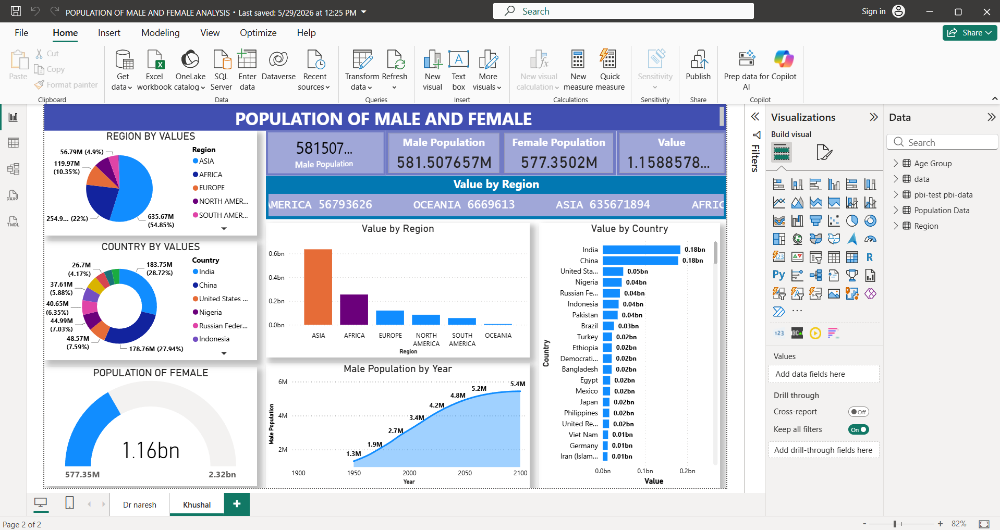
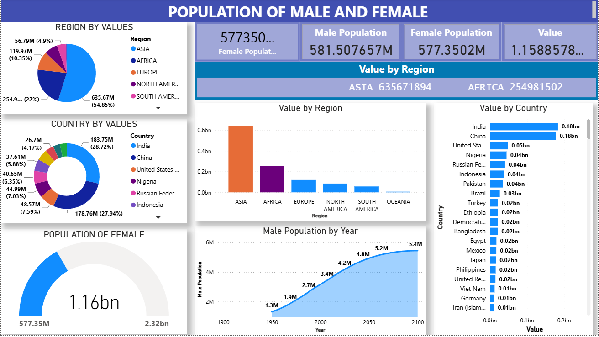
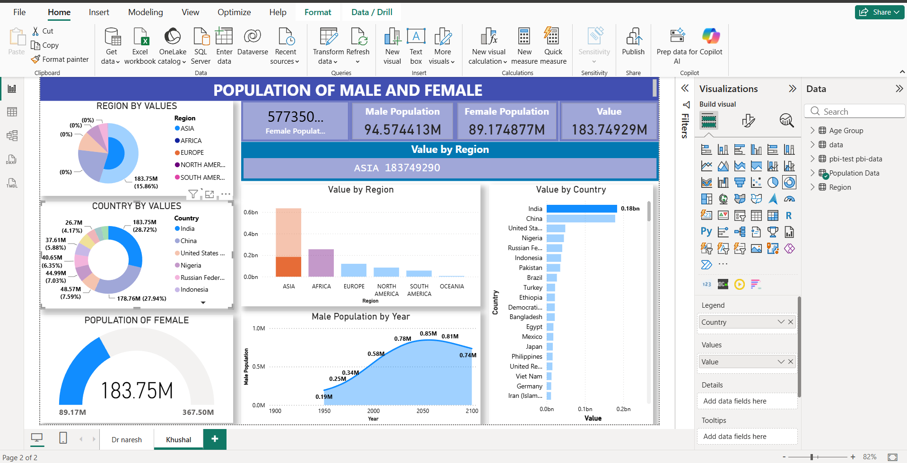
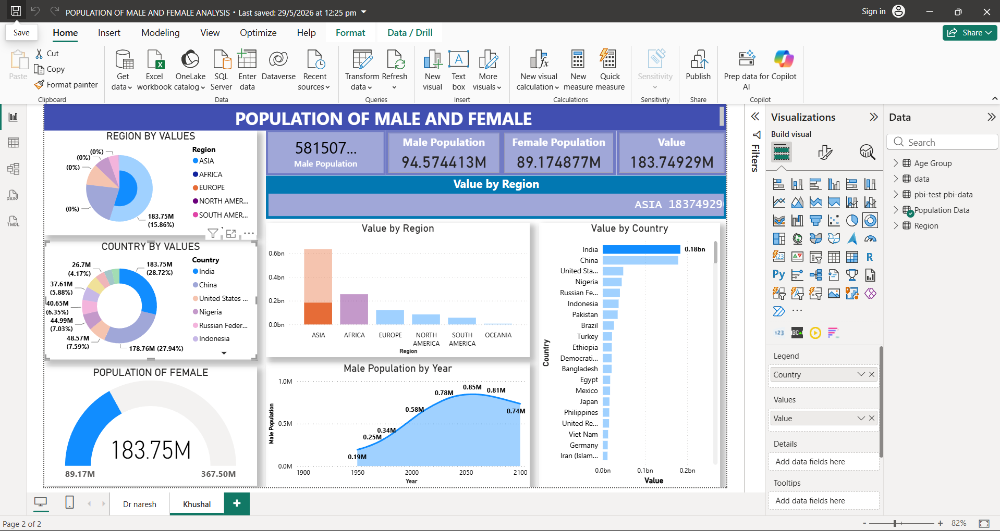

# 🌍 Population of Male and Female Analysis Dashboard | Power BI


---

# 📌 Project Overview

This project is an interactive **Power BI dashboard** developed to analyze the male and female population across different countries and regions. The dashboard transforms raw demographic data into meaningful insights using interactive visualizations, KPI cards, charts, and filters, enabling users to compare population distributions across geographical regions.

---

# 📸 Dashboard Preview

## 🏠 Dashboard Overview



---

## 👨👩 Gender Analysis



---

## 🌎 Country Analysis



---

## 🌍 Region Analysis



---

# 🎯 Project Objectives

- Analyze total population across countries.
- Compare male and female population.
- Explore regional population distribution.
- Identify countries with the highest population.
- Visualize demographic trends using interactive dashboards.
- Enable quick comparison through dynamic filters.

---

# ✨ Dashboard Features

✅ Interactive Dashboard

✅ Total Population KPI

✅ Male Population Analysis

✅ Female Population Analysis

✅ Country-wise Population

✅ Region-wise Population

✅ Interactive Filters & Slicers

✅ Dynamic Charts

✅ Business Insights

---

# 🛠️ Tools & Technologies Used

- Microsoft Power BI
- Power Query
- DAX (Data Analysis Expressions)
- Data Modeling
- Data Visualization

---

# 📊 Key KPIs

- Total Population
- Male Population
- Female Population
- Gender Distribution
- Country-wise Population
- Region-wise Population

---

# 💡 Key Insights

- Compare male and female population across different countries.
- Identify countries with the highest population.
- Analyze regional population distribution.
- Explore demographic patterns using interactive visualizations.
- Filter insights dynamically based on country and region.

---

# 📂 Dataset

The dashboard is built using demographic population data containing information such as:

- Country
- Region
- Male Population
- Female Population
- Total Population

---

# 📁 Repository Structure

```
population-analysis-dashboard-powerbi/
│
├── POPULATION OF MALE AND FEMALE ANALYSIS.pbix
├── dashboard-overview.png
├── gender-analysis.png
├── country-analysis.png
├── region-analysis.png
├── data_set_1.png
├── data_set_2.png
└── README.md
```

---

# 🚀 How to Use

1. Clone this repository.

```
git clone https://github.com/Khushal-dak/population-analysis-dashboard-powerbi.git
```

2. Open the `.pbix` file using **Microsoft Power BI Desktop**.

3. Explore the dashboard using interactive filters and charts.

---

# 📚 Skills Demonstrated

- Data Cleaning
- Data Transformation
- Power Query
- DAX
- Data Modeling
- Dashboard Design
- KPI Development
- Data Visualization
- Business Intelligence

---

# 🔮 Future Improvements

- Add population growth trends.
- Include year-wise population analysis.
- Add forecasting using Power BI.
- Improve dashboard responsiveness.
- Integrate real-time demographic datasets.

---

# 👨‍💻 Author

## **Khushal Dak**

🎓 B.Tech Computer Science Student

📊 Aspiring Data Analyst

---

# 🔗 Connect With Me

### 💼 LinkedIn

https://www.linkedin.com/in/khushal-dak

### 💻 GitHub

https://github.com/Khushal-dak

### 📂 Repository

https://github.com/Khushal-dak/population-analysis-dashboard-powerbi

---

# ⭐ Support

If you found this project useful, please consider giving it a ⭐ on GitHub.

Your support motivates me to build more Data Analytics and Business Intelligence projects.

---

# 📜 License

This project is created for educational and portfolio purposes.
